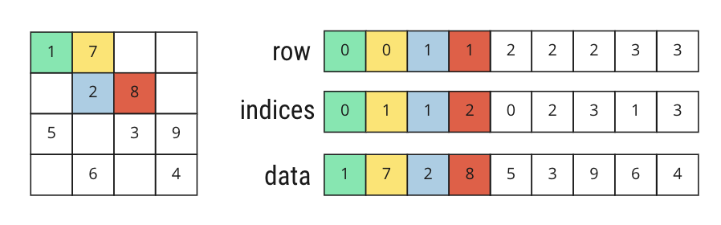
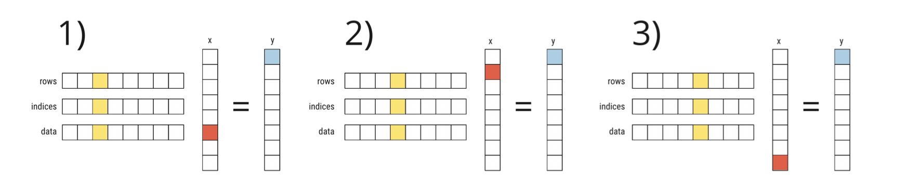
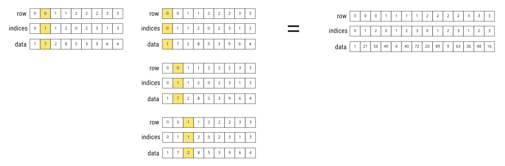

# Programming Language Design - CS 476 - Final Project
## Language for Sparse Matrix Calculus


Contributors: Sofia Lucca, Andrea Carotti

The language we designed is a basic linear algebra language. The main difference between our language and other linear algebra languages, such as Matlab and Julia, is in the use of data structure to represent the data it handles, especially sparse systems.


## Features
- Simple imperative language features already implemented
- Arrays and Matrix declaration (COO format)
- Ability to parse a matrix declared as a long array of given M rows and N columns
- Sum and Subtraction between sparse matrices in COO format
- Multiplication between a matrix A (COO format) and a generic array x
- Multiplication between a matrix A (COO format) and a matrix B (COO format)
- Transpose of matrix A (COO format)
- Basic operations to get useful matrix information:
    a) Trace of the matrix A
    b) Sparsity of the matrix A
    c) Density of the matrix A

## Introduction
Sparse Computation is an operation used in many application domains. Our language tries to address the problem of reading from input a matrix as a long vector (given for example from an input file) parse it, and then perform basic linear algebra operations.

## Types
The types implemented in our lanugage, that extends a simple basic imperative laguage are Vector and the specific types to handle different formats of sparse matrices. In our project we implemented the COO format (Coordinate List) but the same paradigm can be adopted to handle operations with other formats.

# Parse operation
Given a generic list of int with specific support functions we were able to parse the given list into a COO matrix.
```sh
CreateCOO("A", Num 3, Num 3, Vector ([1; 7; 0; 0; 2; 8; 5; 0; 3;]))
```
This operation lets you store inside a COO matrix the original int list provided.




# Sum operation C = A+B
The main idea is going through the coordinates of row and colum of the two parsed matrices, whenever they match the sum between them is performed. In case there is no match the value for that coordinate is still is added to the result. 
The main difficulty for this approach was passing the declaration through the process and extracting the rows and columns indeces from the data object.
```sh
MatSum("C", Var "A", Var "B")
```
Before adding to the resut a check is performed for the results which are 0 that don't have to be added to the result.

# Sub operation C = A-B
The approach for subtraction is analogous to the one for sum.
```sh
MatSub("C", Var "A", Var "B")
```

# Multiplication operation y = A*x
the original C algorithm used for this task suits perfectly OCaml ways of handling lists, since to perform the multiplication you need to scan the rows, columns and data arrays (used to store the matrix) only once.
```sh
MatMul("y", Var "A", Var "x")
```




# Multiplication operation C = A*B
The implementation of this operation was much harder instead. Intuitively the first way to solve the problem would be to treat the B matrix as a group of columns arrays and try to perform the same operation as before. The objective though is to keep matrices in sparse format, so the problem was not solved with this method.

```sh
MatMul("C", Var "A", Var "B")
```




The algorithm proposed first transpose the B matrix, and then scan the support data structures as a "nested" for loop.

Here is the link containing the main idea of the algorithm: https://www.youtube.com/watch?v=x70zNUIHR0k&t=306s&ab_channel=ComputerEngineeringmadeEasy

The last challenging part then is to compress the representation obtained, this is much harder and to achieve this, we first transformed the triplets of the data structures from lists to triples, then we sorted them, then we retransoformed to lists (we couldn't just sort the lists because the i-th value of the list is bounded for the triplets) and finally we applied the compression algorithm to get the final lists.


## Future Work

Future work include extending this language to other formats, like CSR, that is the easier one to implement, then other formats as well.